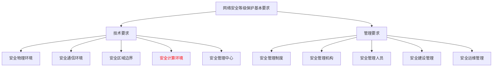

# UXDB实例

## 等保下的数据安全解决方案

> ——网络安全等级保护基本要求之安全计算环境的数据安全

### 1 背景

网络安全等级保护2.0安全防护思想“一个中心，三重防护”的纵深防御体系构建，三重防护下的核心即数据安全防护，在网络安全等级保护2.0基本要求的分类中，将数据安全的相关要求归类在安全计算环境中。数据安全防护核心两点：1 保障数据的可用性、保密性、完整性及数据源的不可否认性；2 数据生命周期各阶段所面临威胁的安全防护。

### 2 数据安全生命周期

  **六个阶段**

1. 创建  ：数字数据产生、已存在内容的修改；
2. 存储  ：数字数据提交到数据存储仓库，与数据创建同步；
3. 使用 ：查看数据、处理数据或其他数据使用活动；
4. 共享 ：让其他实体访问数据的活动，如用户间共享数据；
5. 归档 ：将不频繁使用的数据进行长期保存；
6. 销毁：使用物理或数字方式永久销毁数据。 

### 3 网络安全等级保护基本要求分为技术要求和管理要求

### 4 安全计算环境中关于数据安全的安全防护要求涉及的控制点

**第三级** 安全通用要求之安全计算环境包括11个控制点，每个控制点包含的条款数如下表（表中标*部分为要求数据安全控制点）

| 控制点       | 条款数 | 要求数据安全控制点 |
| ------------ | ------ | ------------------ |
| 身份鉴别     | 4      | *                  |
| 数据完整性   | 2      | *                  |
| 访问控制     | 7      | *                  |
| 数据保密性   | 2      | *                  |
| 安全审计     | 4      | *                  |
| 数据备份恢复 | 3      | *                  |
| 剩余信息保护 | 2      | *                  |
| 入侵防范     | 5      |                    |
| 恶意代码防范 | 1      |                    |
| 个人信息保护 | 2      |                    |
| 可信验证     | 1      |                    |

### 5 数据安全生命周期各阶段与等级保护基本要求条款的对应关系

| 阶段 | 安全通用要求                                                 | 控制点             |
| :--: | ------------------------------------------------------------ | ------------------ |
| 创建 | 应对登录的用户分配账户和权限;                                | 访问控制           |
| 创建 | 应对主体、客体设置安全标记，并依据安全标记和强制访问控制规则确定主体对客体的访问。 | 访问控制           |
| 存储 | 应采用密码技术保证重要数据在存储过程中的保密性、完整性，包括但不限于鉴别数据、重要业务数据和重要个人信息等。 | 数据完整性和保密性 |
| 使用 | 应采用口令、密码技术、生物技术等两种或两种以上组合的鉴别技术对用户进行身份鉴别，且其中一种鉴别技术至少应使用密码技术来实现。 | 身份鉴别           |
| 使用 | 应采用密码技术保证重要数据在传输过程中的保密性，包括但不限于鉴别数据、重要业务数据和重要个人信息等 | 数据完整性和保密性 |
| 使用 | 应采用密码技术保证通信过程中数据的完整性                     | 通信传输           |
| 使用 | 应采用密码技术保证通信过程中数据的保密性                     | 通信传输           |
| 使用 | 应基于硬件密码模块对重要通信过程进行密码运算和密钥管理。     | 通信传输           |
| 使用 | 应启用安全审计功能，审计覆盖到每个用户，对重要的用户行为和重要安全事件 | 安全审计           |
| 共享 | 应由授权主体配置访问控制策略，访问规则策略规定主体对客体的访问控制 | 访问控制           |
| 共享 | 应采用密码技术保证重要数据在传输过程中的保密性、完整性，包括但不限于鉴别数据、重要业务数据和重要个人信息等 | 数据完整性和保密性 |
| 共享 | 应启用安全审计功能，审计覆盖到每个用户，对重要的用户行为和重要安全事件进行审计 | 安全审计           |
| 归档 | 应提供重要数据的本地数据备份与恢复功能;                      | 数据备份和恢复     |
| 归档 | 应提供异地实时备份功能，利用通信网络将重要数据实时备份至备份场地 | 数据备份和恢复     |
| 销毁 | 应保证鉴别信息所在的存储空间被释放或田新分配前得到完全清除   | 剩余信息保护       |
| 销毁 | 应保证存有敏感数据的存储空间被释放或重新分配前得到完全清除。 | 剩余信息保护       |

### 6 计算环境中涉及的控制点介绍

**一、数据完整性**

a) 应采用密码技术保证重要数据在传输过程中的完整性，包括但不限于鉴别数据、重要业务数据、重要审计数据、重要配置数据、重要视频数据和重要个人信息等；

b) 应采用密码技术保证重要数据在存储过程中的完整性，包括但不限于鉴别数据、重要业务数据、重要审计数据、重要配置数据、重要视频数据和重要个人信息等；

**适用保护对象** 主要针对数据存储、使用、共享

数据完整性是指在传输、存储信息或数据的过程中，确保信息或数据不被未授权的篡改或在篡改后能够被迅速发现。条款a）要求基于密码技术保证鉴别数据、重要业务数据、重要审计数据、重要配置数据、重要视频数据和重要个人信息在传输过程中的完整性，并能够在检测到完整性受到破坏时采取恢复措施，如重传或其它方式等；条款b）要求在数据存储过程中，基于密码技术保证鉴别数据、重要业务数据、重要审计数据、重要配置数据、重要视频数据和重要个人信息存储过程中的完整性，并在检测到完整性受到破坏时采取恢复措施。

**二、数据保密性**

a)应采用密码技术保证重要数据在传输过程中的保密性，包括但不限于鉴别数据、重要业务数据和重要个人信息等；

b) 应采用密码技术保证重要数据在存储过程中的保密性，包括但不限于鉴别数据、重要业务数据和重要个人信息等。

**适用保护对象** 主要针对数据存储、使用、共享

数据保密性是指数据不被泄露给非授权用户、实体或过程，或被其利用的特性，数据保密不仅包括数据内容保密还包括数据状态保密。条款a）要求对鉴别数据、重要业务数据和重要个人信息在传输过程中采取基于密码技术的加密措施，如通过密码算法对数据加密处理，使得数据以密文的形式进行传输或数据传输通道使用HTTPS等加密协议保证数据传输过程中的安全；条款b）要求对鉴别数据、重要业务数据和重要个人信息在存储过程中采取基于密码技术的加密措施，如基于密码算法的数据加密机制和密钥管理机制。

**数据备份与恢复：**

a) 应提供重要数据的本地数据备份与恢复功能；

b) 应提供异地实时备份功能，利用通信网络将重要数据实时备份至备份场地；

【适用保护对象】主要针对数据归档

数据备份是容灾的基础，是指为防止系统出现操作失误或系统故障导致数据丢失，而将全部或部分数据集合从应用主机的硬盘或阵列复制到其它的存储介质的过程。数据备份的类型可分为：本地备份、异地热备、异地互备。条款a）要求等级保护对象责任主体对重要数据进行本地备份，并且备份数据可恢复，通常可采用磁带机、光盘库、磁带库等存储设备进行本地备份存储；条款b）要求在异地建立热备份点，并且通过网络同步的方式将主站的数据备份到备份站点。

**剩余信息保护**：

a) 应保证鉴别信息所在的存储空间被释放或重新分配前得到完全清除；

b) 应保证存有敏感数据的存储空间被释放或重新分配前得到完全清除。

【适用保护对象】主要针对数据销毁

剩余信息保护是对用户使用过的信息，当该用户不在使用或不在存在时，应当采取一定的措施保护。剩余信息完全清除的方式有覆盖、消磁和销毁三种，对磁盘可根据信息的敏感程度实施覆盖或消磁，而对于内存可通过断电的方式进行清除。条款a）、b）要求将鉴别信息和敏感数据相关的存储空间在分配给其他用户或空间释放时，存储在里面的信息要完全清除。

### 7 安全防护措施

基于等级保护基本要求，数据安全在其各生命阶段的安全需求及防护措施如下表：

| 数据生命周期阶段 | 数据安全               | 概述                                                         |
| ---------------- | ---------------------- | ------------------------------------------------------------ |
| 创建             | 数据采集认证和风险评估 | 明确采集规范,制定采集策略,完善数据采集风险评估以及           |
| 存储             | 数据传输加密控制       | 保证数据采集的合规合法性。对数据来源进行源鉴别和记录         |
| 归档             | 数据存储加密           | 使用合适的加密算法对数据进行加密传输。                       |
| 使用             | 数据授权和脱敏使用     | 制定存储介质标准和存储系统的安全防护是重要标准               |
| 共享             | 数据安全共享交换       | 数据脱敏的业务场景和统一使用适合的脱敏技术是数据处理的关键。 |
| 销毁             | 数据销毁追溯与责任     | 建立销毁监察机制严防数据销毁阶段可能出现的数据泄露问         |

### 8 数据库基线加固内容

#### 总体要求

由于各个数据库支持的功能不一样，里面的对应等保要求实现方法以及程度不一样，具体可参考对应的加固基线。总体的要求如下：

#### 账号与授权

- 应按照用户分配账号，避免不同用户间共享账号；

- 应删除或锁定与数据库运行、维护等工作无关的账号；
- 删除过期账号；

- 修改或禁用默认管理员账号名称，例如：sa，sys，sysdba等；
- 在数据库权限配置能力内，根据用户的业务需要，配置其所需的最小权限。

#### 安全策略

在数据库支持的范围内，设置和启用相应的安全策略，例如：可以停用不必要的存储过程、加密通讯协议；可以限制超级用户远程登陆等

#### 口令

对采用静态口令认证的数据库，口令长度至少8位，并包括数字、小写字母、大写字母和特殊符号4类中的2-3类。

#### 日志

数据库应配置日志审计功能，并做好日志留存工作。

#### 安全补丁

在保证业务可用性的前提下，经过分析测试后（在非生产环境中），可以选择更新使用最新版本的补丁。这里具体可以以漏扫结果作为标准，如果漏扫没有问题，也可以不安装补丁。

#### IP地址/端口访问控制

通过数据库所在操作系统或网络中的防火墙限制，只有信任的IP地址/端口才能通过监听器访问数据库。